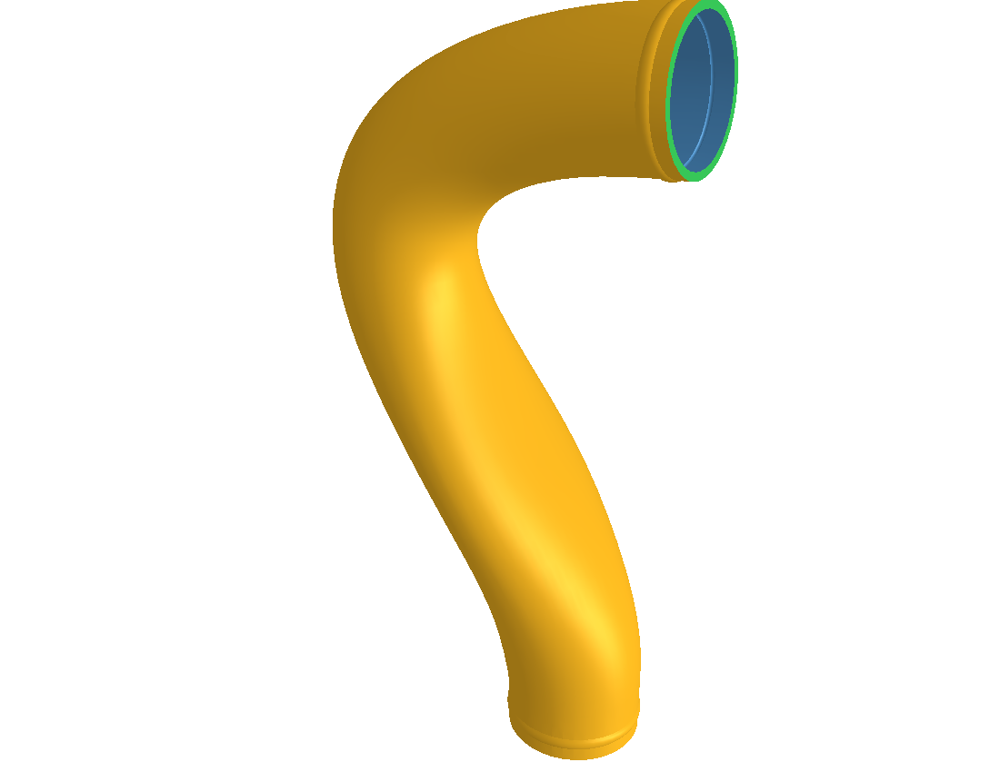
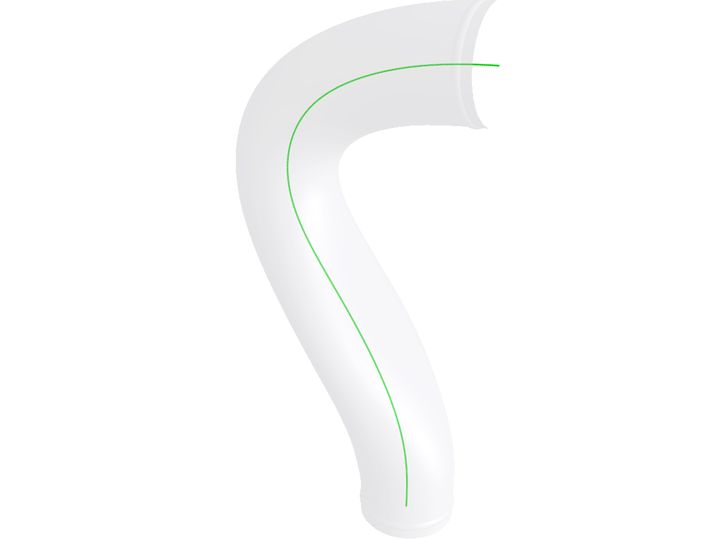
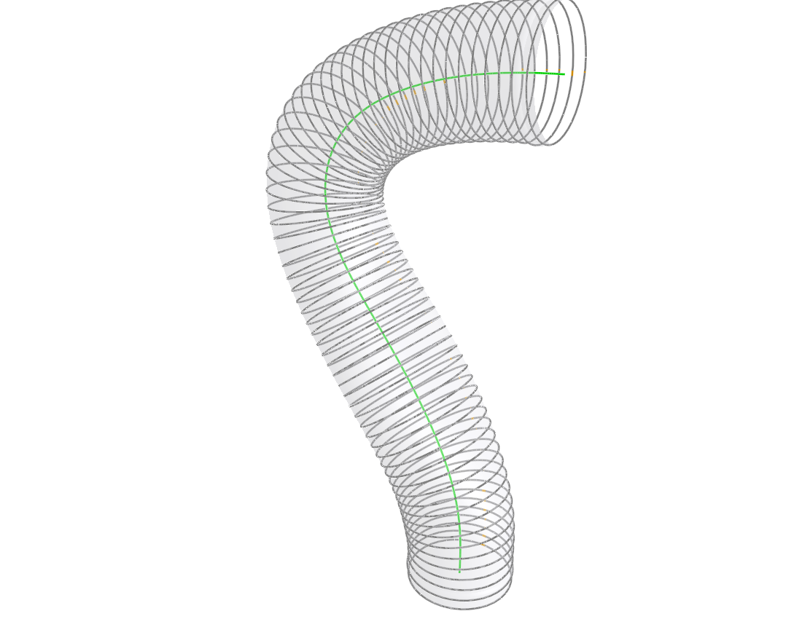
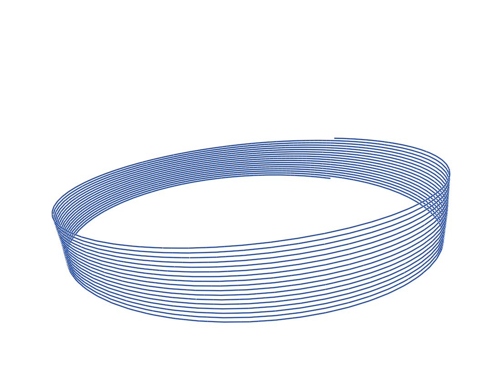
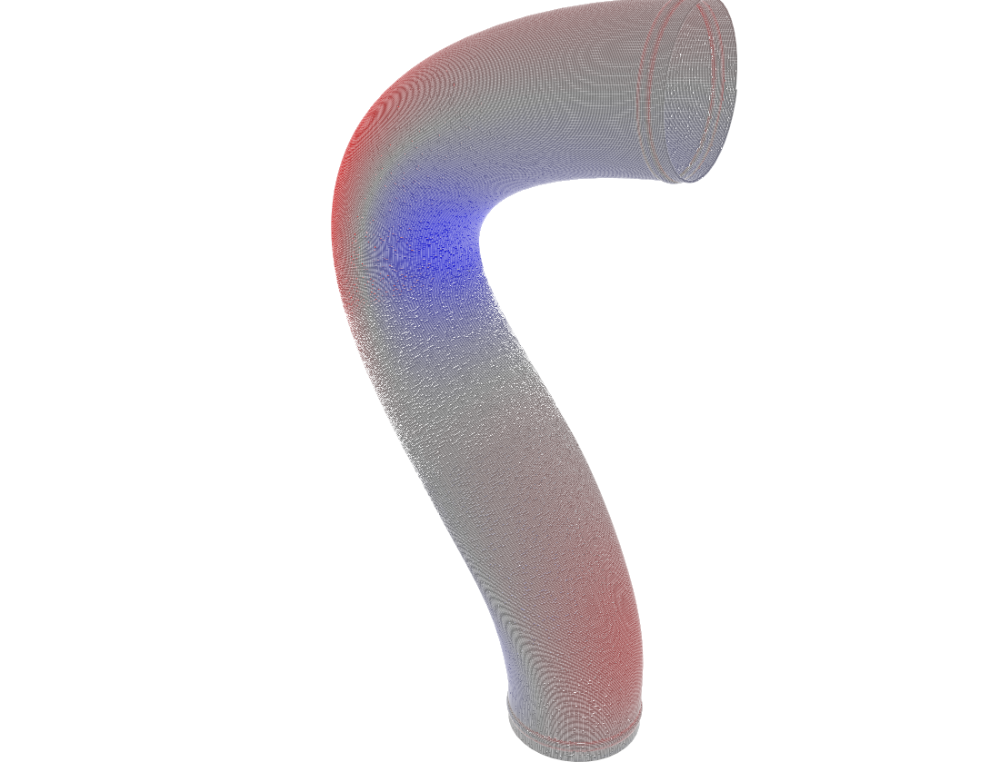

# pipe-slicer

A non-planar, "vase mode" slicer for **curved tubes**. Conventional slicers cut a
model into flat horizontal layers stacked along Z. That works badly for a pipe
that bends through space: the layers meet the wall at a shallow angle, and the
seam/quality follows gravity instead of the tube. `pipe-slicer` instead finds the
tube's own **centerline** and lays down a single continuous spiral bead that
follows the curve, compensating extrusion flow around bends so the wall stays
solid.

The whole pipeline is driven by [`basic_run.py`](pipe_slicer/runner/basic_run.py)
and illustrated below on the example part in
[`tests/tubes/tube.STL`](tests/tubes/tube.STL) — an S-shaped pipe.

---

## Step 1 — Import & segment the mesh

[`io/load.py`](pipe_slicer/io/load.py)

The STL is loaded and cleaned up (merge vertices, drop degenerate/duplicate
faces, fix normals). The mesh is then **segmented into four regions** by walking
the face-adjacency graph and cutting edges where two faces meet at roughly 90°.
A well-formed tube always splits into exactly four pieces, which are identified
by area and position:

| Color | Region | Role |
|-------|--------|------|
| 🟠 orange | **outer** wall | the surface the tool path is built on |
| 🔵 blue | **inner** wall | the bore |
| 🔴 red | **bottom** face | sits on the build plate (must be planar) |
| 🟢 green | **top** face | the terminating rim |



## Step 2 — Find the centerline

[`algorithm/centerline.py`](pipe_slicer/algorithm/centerline.py)

Starting from the bottom face, the slicer **marches** through the tube: at each
step it cuts a plane through the wall, takes the centroid of the resulting
cross-section, and steps forward along the direction to that centroid. This
traces a coarse path down the axis, which is fit to a smooth B-spline.

The spline is then **refined**: it is re-sampled at uniform arc length, the wall
is re-cut *orthogonally* to the current spline tangent, and the fit is redone
through the new centroids (anchored at the two end-face centroids). Orthogonal
cuts of an axisymmetric tube put the centroid on the true axis, so each pass
removes the lag the coarse march leaves on bends.



## Step 3 — Slice into cross-section rings

[`algorithm/slicer.py`](pipe_slicer/algorithm/slicer.py)

Walking the centerline at a fixed step distance (0.4 mm here), the outer wall is
cut with a plane **perpendicular to the centerline** at each point, giving a
stack of closed rings that hug the curve instead of lying flat.

To connect rings consistently, each carries a **rotation-minimizing frame** (RMF,
propagated by double reflection) that defines a twist-free azimuth reference. A
single "zero point" is marked on every ring where the frame's reference ray hits
it (the orange dots), so the same angle means the same place on consecutive
rings.



## Step 4 — Build one continuous spiral

[`algorithm/spiral.py`](pipe_slicer/algorithm/spiral.py)

The rings are woven into a **single unbroken helix**, exactly like vase mode in a
normal slicer but following the tube. Consecutive rings are matched point-for-point
by RMF azimuth, and the path blends smoothly from one ring to the next as it winds
around:

```
point(t) = (1 - t) · ring_i(t) + t · ring_{i+1}(t)      t: 0 → 1
```

At `t = 1` the path lands exactly on the next ring's zero point, where the next
winding begins — so there are no layer changes and no seam. The closeup below
shows ~15 windings of that single climbing bead.



## Step 5 — Flow compensation

[`flow/flow.py`](pipe_slicer/flow/flow.py)

On a bend, windings on the **inside** of the curve crowd together while those on
the **outside** stretch apart. Constant extrusion would over-stuff the inside and
leave gaps outside. For each point the slicer measures the real distance to the
winding directly below it and sets an extrusion multiplier of `spacing / h`.
It also hard-fails if windings collide or a gap grows too wide to fuse.

Below, the same spiral is colored by flow: **blue = starved** (inside of the
bend, less plastic) and **red = overfed** (outside, more plastic).



## Step 6 — Emit G-code

[`gcode/emitter.py`](pipe_slicer/gcode/emitter.py)

Each spiral segment becomes one `G1` move. The extruded volume per segment is
`lineWidth · h · segmentLength · flow`, divided by the filament cross-section to
get the absolute E value. The result is a ready-to-print program
([`GCodeConfig`](pipe_slicer/types.py) holds the printer/material parameters):

```gcode
; --- spiral body ---
M82 ; absolute extrusion
G92 E0
G0 F6000 X174.094 Y56.272 Z39.222
G1 F1200
G1 X173.377 Y56.242 Z39.232 E0.05365
G1 X172.661 Y56.211 Z39.241 E0.10730
G1 X171.945 Y56.181 Z39.251 E0.16094
```

---

## Running it

```bash
python -m pipe_slicer.runner.basic_run
```

This runs the full pipeline on `tests/tubes/tube.STL` and writes
`tests/tubes/gcodeOut/tube.gcode`. Key knobs live in
[`basic_run.py`](pipe_slicer/runner/basic_run.py): `step_dist` (winding spacing)
and the `calcFlow` limits (`minFlow`, `maxFlow`, `collisionRatio`, `gapRatio`).
